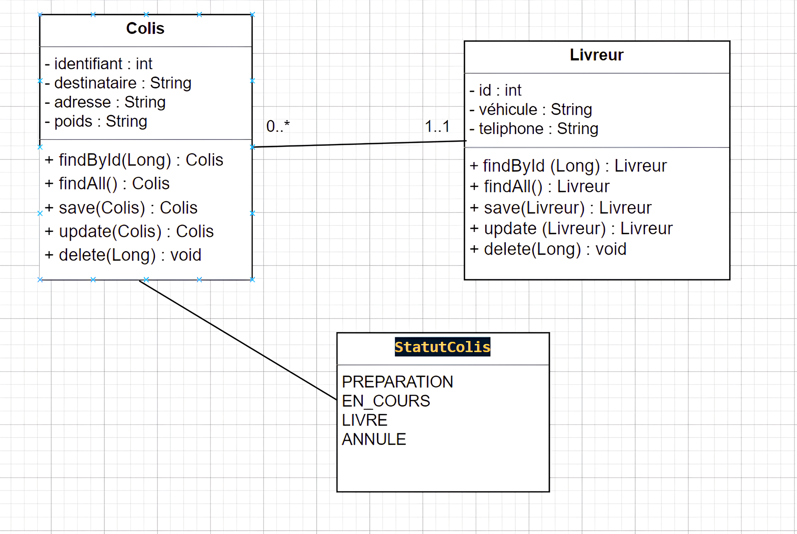
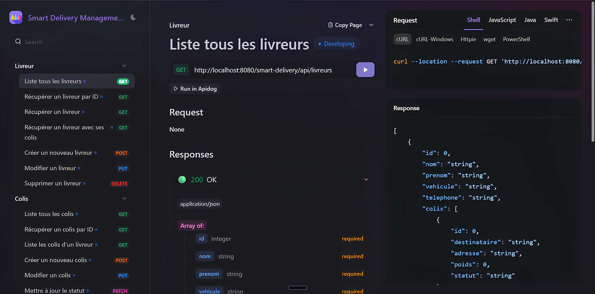

# 📦 Smart Delivery Management System

Système de gestion de livraisons pour **SmartLogi** utilisant **Spring Core avec configuration XML pure** et **Spring MVC REST API**.

---
## 🔧 Prérequis et Technologies

### 💻 Technologies Utilisées

  
  
  
  
  
  
  
  
  
  
  
  

---

## 📊 Diagramme de Classes UML

Le diagramme ci-dessous illustre la structure complète du système avec les entités, les relations, et les couches architecturales.

### Description du Diagramme

#### Entités Principales

**Livreur**
- Représente un livreur avec ses informations personnelles
- Attributs : id, nom, prenom, vehicule, telephone
- Relation : Un livreur peut avoir plusieurs colis (One-to-Many)

**Colis**
- Représente un colis à livrer
- Attributs : id, destinataire, adresse, poids, statut
- Relation : Un colis appartient à un seul livreur (Many-to-One)

**StatutColis (Enum)**
- Énumération des statuts possibles d'un colis
- Valeurs : PREPARATION, EN_COURS, LIVRE, ANNULE

---

## 🌱 Spring Core - 

### Principe Fondamental

Ce projet utilise **Spring Core avec configuration XML pure**, sans aucune annotation de stéréotype (@Component, @Service, @Repository). Toute la configuration des beans et l'injection de dépendances sont définies dans les fichiers XML.

## 📡 API REST Documentation

### Base URL
\`\`\`
http://localhost:8080/smart-delivery/api
\`\`\`

## 🚀 Lancement du Serveur

###  Maven Tomcat Plugin (Recommandé)
\`\`\`bash
mvn clean tomcat7:run
\`\`\`

Le serveur démarre sur **http://localhost:8080/smart-delivery**

# Démarrer Tomcat
$TOMCAT_HOME/bin/startup.sh
\`\`\`

### Vérification
\`\`\`bash
curl http://localhost:8080/smart-delivery/api/livreurs
\`\`\`

---

## 🧪 Tests avec Apidog

#### 1. Créer un environnement

- **Nom** : Local Development
- **Base URL** : `http://localhost:8080/smart-delivery/api`

#### 2. Importer les endpoints

Créez les endpoints suivants dans Apidog :

**Livreurs**
- `GET` `/livreurs` - Liste tous les livreurs
- `GET` `/livreurs/{id}` - Récupérer un livreur
- `POST` `/livreurs` - Créer un livreur
- `PUT` `/livreurs/{id}` - Modifier un livreur
- `DELETE` `/livreurs/{id}` - Supprimer un livreur

**Colis**
- `GET` `/colis` - Liste tous les colis
- `GET` `/colis/{id}` - Récupérer un colis
- `POST` `/colis` - Créer un colis
- `PUT` `/colis/{id}` - Modifier un colis
- `PATCH` `/colis/{id}/statut` - Mettre à jour le statut
- `GET` `/colis/livreur/{livreurId}` - Colis d'un livreur
- `DELETE` `/colis/{id}` - Supprimer un colis

## 🎓 Concepts Clés Démontrés

### Spring Core
- ✅ Inversion of Control (IoC)
- ✅ Dependency Injection (Constructor & Setter)
- ✅ Configuration XML pure
- ✅ Bean Scopes (Singleton, Prototype)
- ✅ Transactions déclaratives

### Spring MVC
- ✅ DispatcherServlet
- ✅ @RestController
- ✅ @RequestMapping
- ✅ Sérialisation JSON automatique
- ✅ Gestion des erreurs HTTP

### JPA / Hibernate
- ✅ EntityManager
- ✅ JPQL
- ✅ Lazy Loading
- ✅ Mappings XML
- ✅ Relations bidirectionnelles

---

## 📚 Ressources

- [Spring Framework 5.3 Documentation](https://docs.spring.io/spring-framework/docs/5.3.x/reference/html/)
- [Spring Data JPA 2.7 Documentation](https://docs.spring.io/spring-data/jpa/docs/2.7.x/reference/html/)
- [Hibernate 5.6 User Guide](https://docs.jboss.org/hibernate/orm/5.6/userguide/html_single/Hibernate_User_Guide.html)
- [Apidog Documentation](https://apidog.com/help/)

---

## 👨‍💻 Auteur

Projet développé par Oumayma Bramid pour démontrer l'utilisation de **Spring Core avec configuration XML pure** et **Spring MVC REST API**.

---

## 📄 Licence

Ce projet est à usage éducatif.
